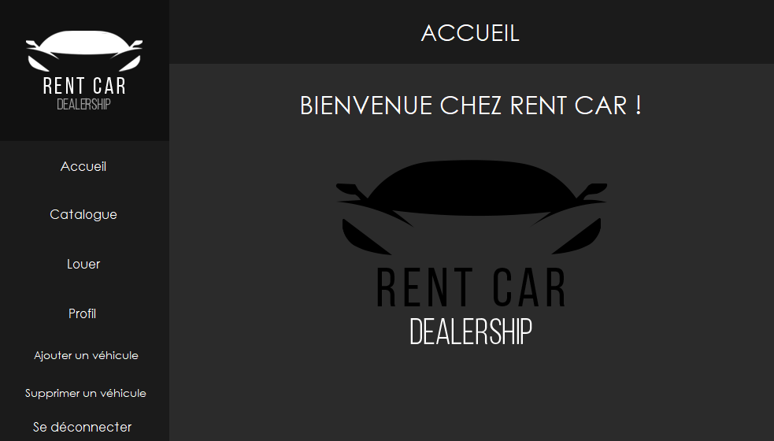

    

# RentCar

RentCar est une application de location de véhicules.

    

 

## 📌&nbsp; À propos

### Partie Utilisateur
- Connexion et création de compte
- Consulter et ajouter des véhicules à sa liste de réservation
- Louer des véhicules
- Consulter son historique ainsi que son profil

### Partie Administrateur
- Ajout et suppression de véhicules

Afin d'en apprendre plus sur l'application, se référer au [Wiki](https://github.com/MalekGuez/RentCar/wiki).

 

# 🛠 Développé avec

&nbsp;
&nbsp;
